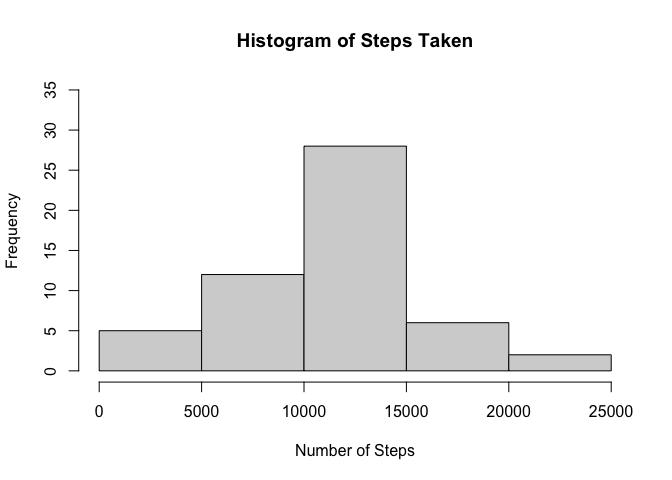
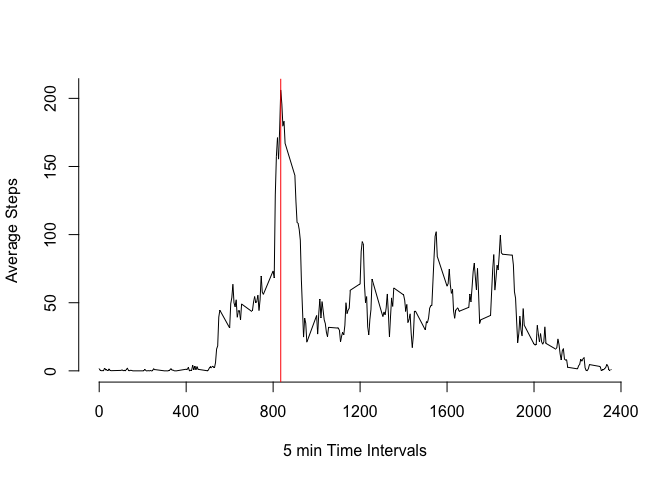
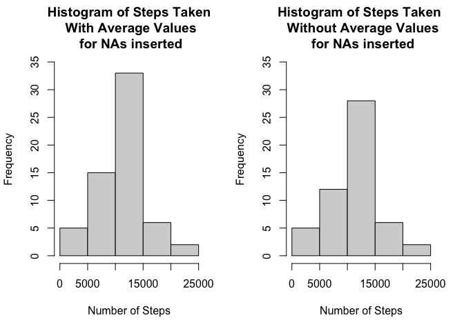
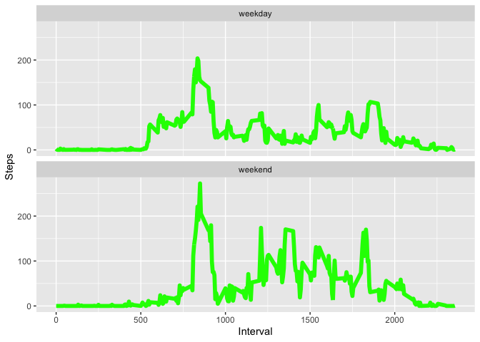
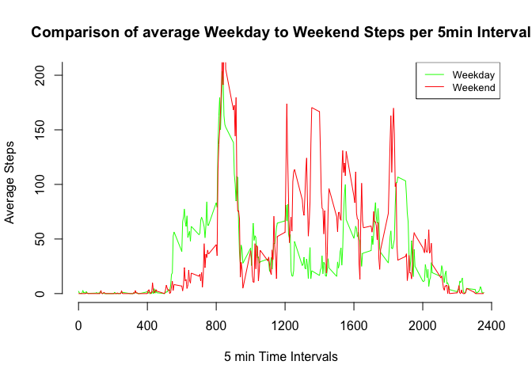

## Loading and preprocessing the data
For this assignment we will assume that a file called "activity.csv" is available in the working directory and so we'll  load it into a object called amd (Activity Monitoring Data) using the read.csv function.
  
We will create an additional object called amd.noNA which will have the rows with NA for steps removed (subsetted) .

```r
amd <- read.csv("activity.csv")
amd.noNA <- subset(amd,!(is.na(amd$steps)))
```

## What is mean total number of steps taken per day?
We can calculate the total number of steps taken using the sum() function, we can also calculate the average number of steps per day if we divide the total number of steps by the number of days

```r
sum(amd.noNA$steps)
```

```
## [1] 570608
```

```r
sum(amd.noNA$steps) / length(unique(amd.noNA$date))
```

```
## [1] 10766.19
```
We can also create a histogram of steps by using the aggregate() function to aggregate the amd.noNA object on date and the hist() function to display this. and also calculate the mean and median of steps using the mean() and median() functions.  

```r
stepsPerDay <- aggregate(amd.noNA$steps,by=list(Category=amd.noNA$date),FUN=sum)
hist(stepsPerDay$x,ylim=c(0,35),main="Histogram of Steps Taken",xlab="Number of Steps")
```

<!-- -->

```r
mean(stepsPerDay$x)
```

```
## [1] 10766.19
```

```r
median(stepsPerDay$x)
```

```
## [1] 10765
```

## What is the average daily activity pattern?
For this part of the assignment we will use the aggregate function to average steps for each 5 minute interval and then create a line graph using the plot() function.  
  
We can then calculate the time period with the highest frequency of average steps using the which.max() function, which we can plot on the graph using the abline() function.


```r
stepsByInterval <- aggregate(amd.noNA$steps,by=list(Category=amd.noNA$interval),FUN=mean)
plot(stepsByInterval$Category,stepsByInterval$x,xlab="5 min Time Intervals",ylab="Average Steps",axes=FALSE,type="l")
axis(1,at=seq(0, 2400, by=400))
axis(2, at=seq(0,250,by=50))
abline(v=stepsByInterval$Category[which.max(stepsByInterval$x)], col="red")
```

<!-- -->
  
Just for completeness, display the time interval for which we get the highest average number of steps by using the which.max() function.
  

```r
stepsByInterval$Category[which.max(stepsByInterval$x)]
```

```
## [1] 835
```

## Imputing missing values
Next we calculate and report the total number of missing values in the dataset (i.e. the total number of rows with NAs)


```r
sum(is.na(amd))
```

```
## [1] 2304
```
  
To address missing values we will calculate the mean number of steps per interval per day of the week. First we'll add a day-of-the-week column to the ams object (using the lubridate package) and then create an aggregate object for average steps per weekday per interval (using the dplyr package). We can then merge the average steps per day per interval into a new object (amd.avg) and create a new column (steps) using the transform function so that the value will be either the actual number of steps or the calculate average depending on whether the original steps value is NA.Finally, we can aggregate the amd.avg (as per previously)
  

```r
library(lubridate)
```

```
## 
## Attaching package: 'lubridate'
```

```
## The following objects are masked from 'package:base':
## 
##     date, intersect, setdiff, union
```

```r
library(dplyr)
```

```
## 
## Attaching package: 'dplyr'
```

```
## The following objects are masked from 'package:stats':
## 
##     filter, lag
```

```
## The following objects are masked from 'package:base':
## 
##     intersect, setdiff, setequal, union
```

```r
# Add weekday value to amd and amd.noNA objects
amd.noNA$dow <- wday(as.Date(amd.noNA$date))
amd$dow <- wday(as.Date(amd$date))
# Create an object with average steps by interval per day of the week
stepsByIntervalByDay <- amd.noNA %>% group_by(interval,dow) %>% summarise_at(vars(steps),mean)
# Merge the two objects using interval and dow to match
amd.avg <- merge(x=amd,y=stepsByIntervalByDay,by.x=c("interval","dow"),by.y=c("interval","dow"))
# Create new column in amd.avg object that is either the steps value from the original data frame or the average calculated value if the original value was NA
amd.avg <- transform(amd.avg, steps = ifelse(is.na(steps.x),steps.y,steps.x))
stepsPerDayAvg <- aggregate(amd.avg$steps,by=list(Category=amd.avg$date),FUN=sum)
```

We can now repeat the function calls to create a histogram of steps taken and create mean and average step values (we will display the original and new histograms side by side to show the comparison).


```r
par(mfrow=c(1,2))
hist(stepsPerDayAvg$x,ylim=c(0,35),main="Histogram of Steps Taken\n With Average Values\n for NAs inserted",xlab="Number of Steps")
hist(stepsPerDay$x,ylim=c(0,35),main="Histogram of Steps Taken \n Without Average Values\n for NAs inserted",xlab="Number of Steps")
```

<!-- -->

```r
mean(stepsPerDayAvg$x)
```

```
## [1] 10821.21
```

```r
median(stepsPerDayAvg$x)
```

```
## [1] 11015
```

The impact of imputting the missing data on total step count can be calculated by subtracting the sum of steps in the uncorrected data from the corrected data (over 89,000 more steps)


```r
sum(amd.avg$steps) - sum(amd.noNA$steps)
```

```
## [1] 89485.79
```
## Are there differences in activity patterns between weekdays and weekends?

We will start by labeling which days are weekdays and which are weekends. Previously we have added a dow column to the amd.avg object, we will now add a column called weekday (TRUE if Mon-Fri and FALSE for Sun & Sat). We can then re-summarize the data, grouping on interval and the newly created weekday logical column.


```r
library(ggplot2)
amd.avg <- transform(amd.avg, daytype = as.factor(ifelse(dow <6,"weekday","weekend")))
stepsPerDayType <-  aggregate(steps ~ interval + daytype, amd.avg, FUN=mean)
ggplot(stepsPerDayType, aes(x=interval,y=steps)) + geom_line(color="green",size=2) + facet_wrap(~daytype,nrow=2) + labs(x="Interval",y="Steps")
```

<!-- -->

Personally I find it easier to compare the weekday/weekend data if we superimpose the data on the same plot.


```r
stepsByIntervalByWoW <- amd.avg %>% group_by(interval,daytype) %>% summarise_at(vars(steps),mean)

plot(stepsByIntervalByWoW$interval[stepsByIntervalByWoW$daytype == "weekday"],stepsByIntervalByWoW$steps[stepsByIntervalByWoW$daytype == "weekday"], col = "Green", type="l", xlab="5 min Time Intervals",ylab="Average Steps",axes=FALSE, main="Comparison of average Weekday to Weekend Steps per 5min Interval")
lines(stepsByIntervalByWoW$interval[stepsByIntervalByWoW$daytype == "weekend"],stepsByIntervalByWoW$steps[stepsByIntervalByWoW$daytype == "weekend"], col = "Red")
legend("topright",legend=c("Weekday","Weekend"),col=c("Green","red"),lty=1,cex=0.8)
axis(1,at=seq(0, 2400, by=400))
axis(2, at=seq(0,500,by=50))
```

<!-- -->

The plotted data indicates that there are more steps taken during the weekday between interval 500 and 800 than the weekend. This could indicate that on average the test subjects got up earlier in the morning during weekdays. The plot also highlights a greater number of steps taken between interval 1200 and 1600 for weekend activity as compared to weekdays. This could be used to infer that the test subjects were more active during the day at the weekends (perhaps as a consequence of sedentary working lifestyles)
